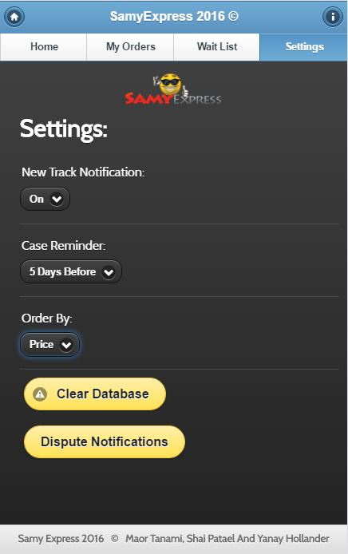

# SamyExpress Mobile 2016

The application's aim is to help track and manage personal orders from China.  
It can be viewed on any smartphone using jQuery Mobile & PhoneGap.  

## Features
* Take pictures of products using the phone's camera. (uploads images to server)    
* Tracking Number information using Israel Post's API.  
* E-mail notifications for Dispute reminder.  
* Multi-user approach.  
* Client Side was built using: Javascript, jQuery & jQuery Mobile, Ajax, Phonegap (Cordova), HTML, CSS.    
* Server Side was built using: ASP.NET, C#, Microsoft SQL Server.    

## Screenshots

